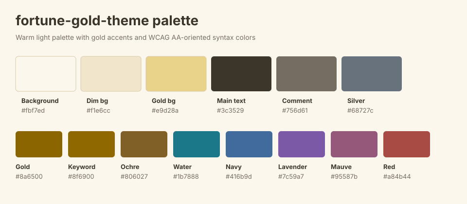

#+title: fortune-gold-theme

~fortune-gold-theme~ is a warm light Emacs theme based on a fortune-oriented
palette.  It is implemented as a derivative theme built on ~modus-themes~ and
~ef-themes~.

The design keeps yellow/gold as the main lucky color, uses warm white and beige
for the base, and supports syntax with water blue, lavender, pink, red, orange,
silver, and restrained green.

* Design Goals

- Light theme direction
- Yellow/gold as the dominant accent
- Warm white and beige ambient base
- Syntax colors close to WCAG AA contrast, roughly 4.5:1 to 5.5:1
- Main text with a larger readability margin
- Plain blue and green kept secondary because they had mixed fortune signals
- Broad face coverage provided by the Modus/Ef ecosystem

* Dependencies

- Emacs ~28.1+~
- ~modus-themes 5.0.0+~
- ~ef-themes 2.0.0+~

* Acknowledgements

~fortune-gold-theme~ is built on the work of Protesilaos Stavrou, the author of
~modus-themes~ and ~ef-themes~.  The broad face coverage, Modus-derived theme
structure, and Ef-style semantic palette vocabulary are provided by those
projects.

* Palette

| Role                      | Hex       |
|---------------------------+-----------|
| Background                | ~#fbf7ed~ |
| Dim background            | ~#f1e6cc~ |
| Gold highlight background | ~#e9d28a~ |
| Main text                 | ~#3c3529~ |
| Gold accent               | ~#8a6500~ |
| Keyword gold              | ~#8f6900~ |
| Ochre                     | ~#806027~ |
| Water blue                | ~#1b7888~ |
| Soft navy                 | ~#416b9d~ |
| Lavender                  | ~#7c59a7~ |
| Pink mauve                | ~#95587b~ |
| Deep red                  | ~#a84b44~ |
| Orange amber              | ~#9c5a2d~ |
| Beige gray                | ~#756d61~ |
| Silver gray               | ~#68727c~ |
| Muted green               | ~#5b744e~ |

* Load Locally

Add this directory to ~custom-theme-load-path~ and load the theme.

#+begin_src emacs-lisp
(package-install 'modus-themes)
(package-install 'ef-themes)

(add-to-list 'custom-theme-load-path
             "/home/nobu43/.emacs.d/lisp/fortune-gold-theme.el")
(load-theme 'fortune-gold t)
#+end_src

For package-style loading:

#+begin_src emacs-lisp
(add-to-list 'load-path "/home/nobu43/.emacs.d/lisp/fortune-gold-theme.el")
(require 'fortune-gold-theme)
(load-theme 'fortune-gold t)
#+end_src

* Development

Evaluate or reload ~fortune-gold-theme.el~, then run:

#+begin_src emacs-lisp
(load-theme 'fortune-gold t)
#+end_src

If another theme is already enabled:

#+begin_src emacs-lisp
(mapc #'disable-theme custom-enabled-themes)
(load-theme 'fortune-gold t)
#+end_src

* Implementation Model

- ~fortune-gold-palette-partial~ defines the theme-specific colors.
- ~fortune-gold-palette-mappings-partial~ maps semantic roles such as keyword,
  string, fnname, warning, region, headings, search, and terminal colors.
- ~fortune-gold-palette~ is generated with ~modus-themes-generate-palette~ and
  ~ef-themes-palette-common~.
- ~fortune-gold-custom-faces~ is reserved for narrow package-specific overrides.
